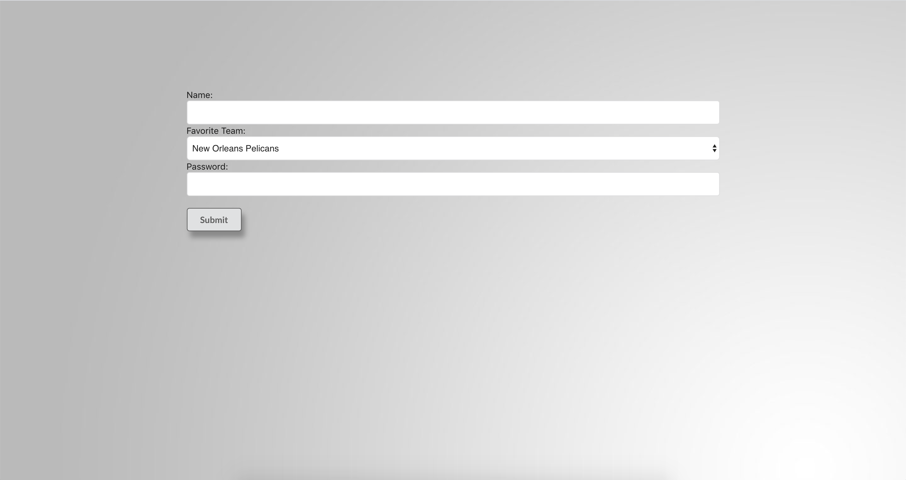
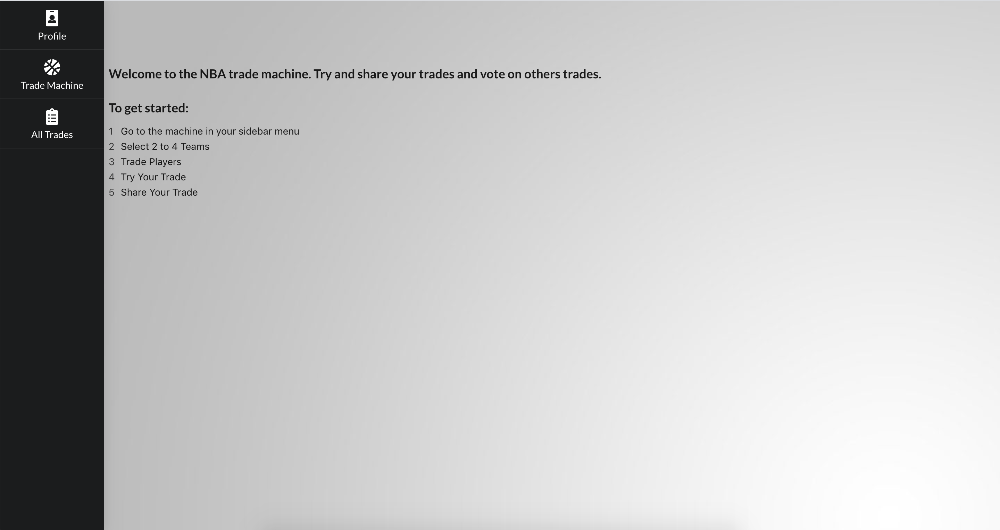
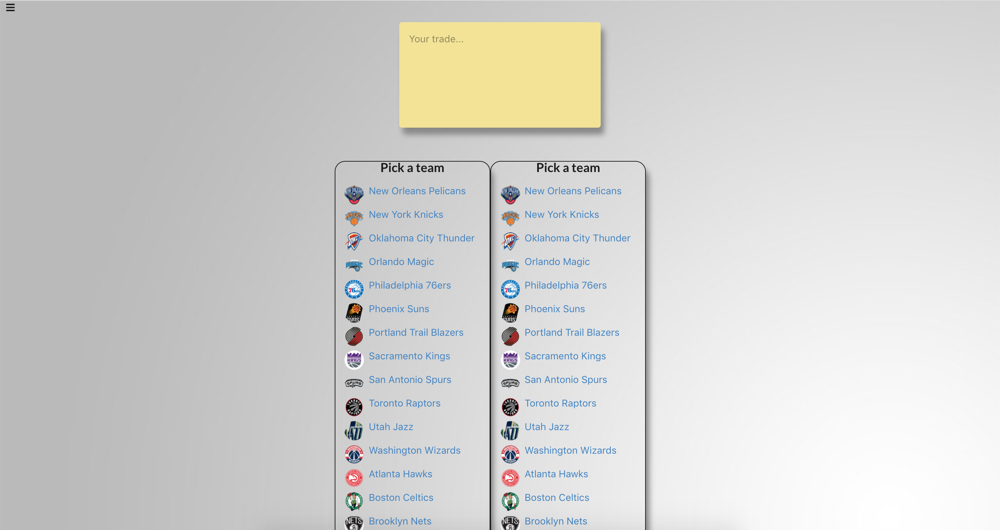
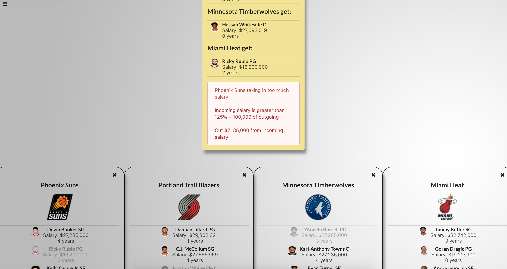
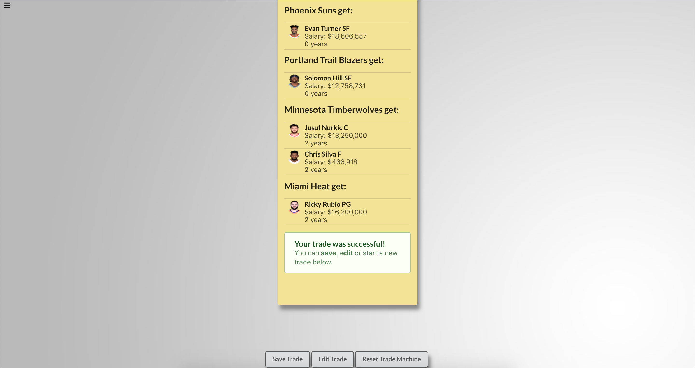
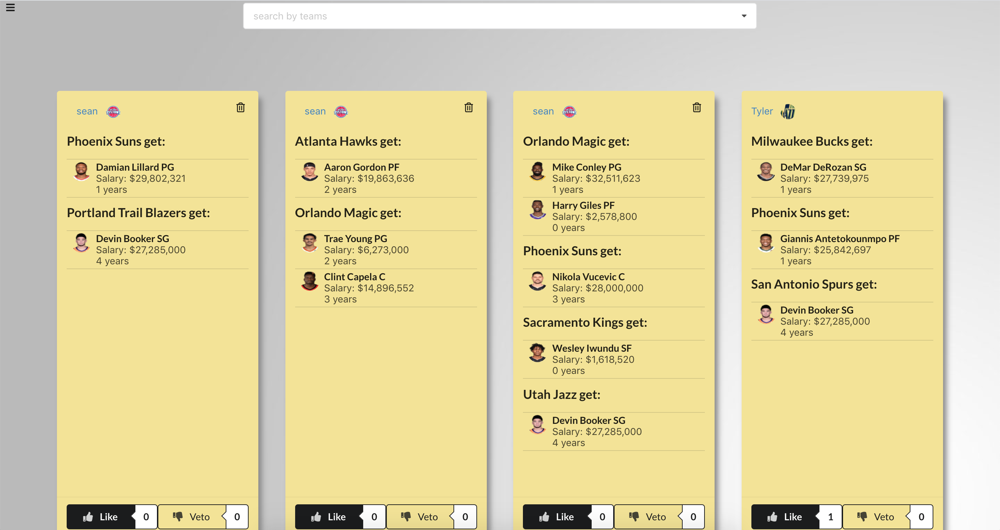
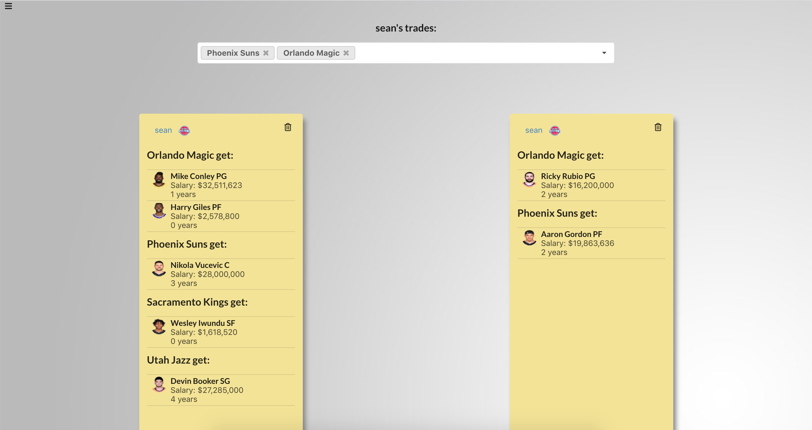

# NBA Trade Machine
Welcome to the NBA Trade Machine, where you can test potential trades by NBA rules and share them with other users. 
Available features:
- **Users can sign up and log in**
- **Users can test trades of up to 4 NBA teams to see if they would be legal under the NBA's salary cap rules**
- **Users can save and share trades with other users**
- **Users can like other users trades**
- **Users can 'veto' other users trades if their favorite team is involved**
## Installation

- Fork and clone this repo and [the backend repo](https://github.com/seanb113/nbatrademachine_backend)

- First cd into the nbatrademachine_backend directory in the backend repo
  - Run `$ rails db:create`
  - Run `$ rails db:migrate`
  - Run `$ rails db:seed`
  - Run `$ rails s -p 5000`
- After the backend is up, cd into the nbatrademachine directory in the frontend repo
  - Run `$ npm install`
  - Run `$ npm start`

## Screenshots of App Experience

#### Login Screen
 

#### Sign Up Screen

#### Instructions Screen With Menu
 

#### Trade Machine Screen
 

#### Failed Trade Screen
 

#### Successful Trade Screen

#### All Trades Screen

#### User Profile Screen With Multi Search
 

## Frameworks and Libraries Used

- Front-end: React.js
- Back-end: [Ruby on Rails](https://github.com/rails/rails)
- [Semantic-UI](https://semantic-ui.com/)

## Author
- Sean Beach (https://github.com/seanb113)

## Contributing
Bug reports and pull requests are welcome on GitHub at https://github.com/seanb113/nbatrademachine/issues. This project is intended to be a safe, welcoming space for collaboration, and contributors are expected to adhere to the [Contributor Covenant](http://contributor-covenant.org) code of conduct.

## License

The code is available as open source under the terms of the [MIT License](https://opensource.org/licenses/MIT).
