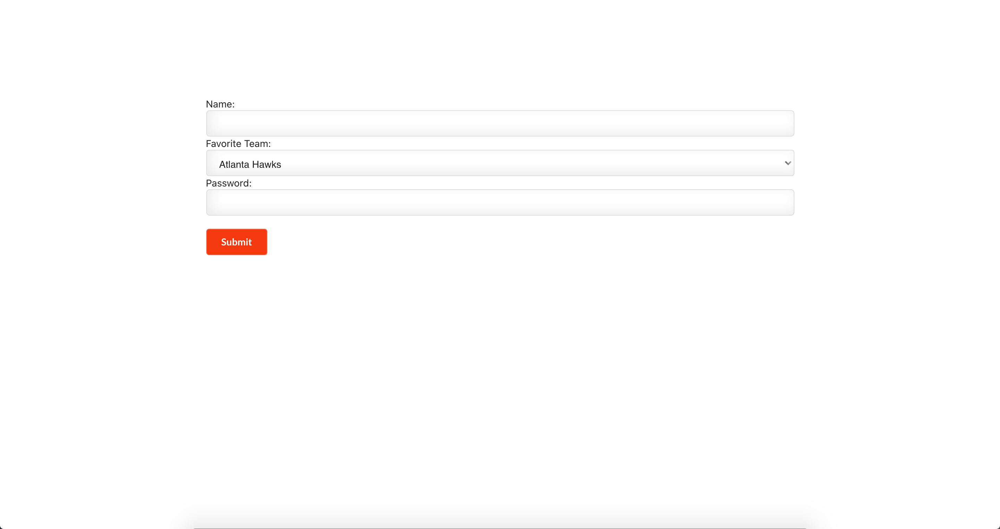
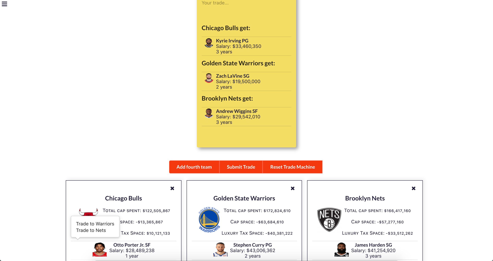
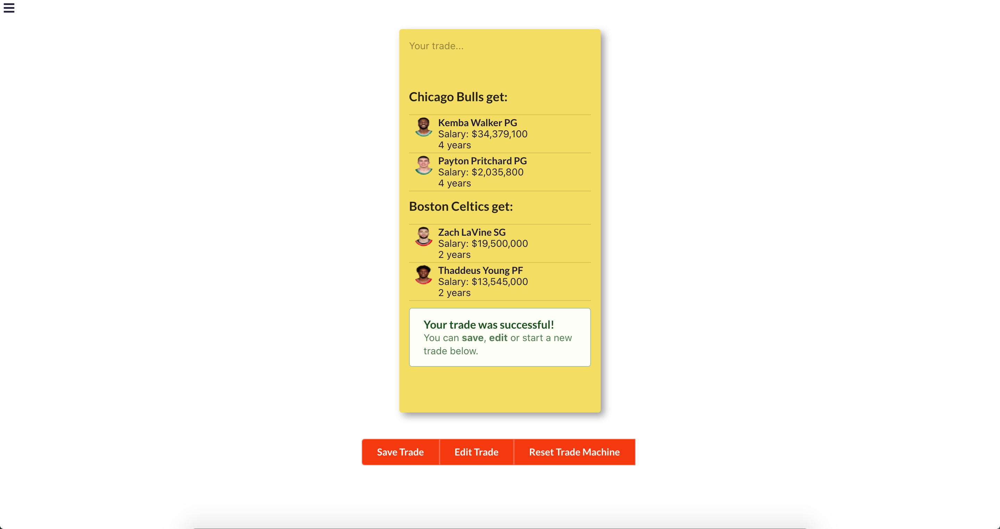

# NBA Trade Machine
Welcome to the NBA Trade Machine, where you can test potential trades by NBA rules and share them with other users. Visit the backend repo [here](https://github.com/seanb113/nbatrademachine_backend). Visit the live app [here](https://nbatrademachine-app.herokuapp.com/).

## Screenshots of App Experience

#### Login Screen
 

#### Sign Up Screen

#### Instructions Screen With Menu
 

#### Trade Machine Screen
 

#### Failed Trade Screen
 

#### Successful Trade Screen

#### All Trades Screen With Multi Search

#### User Profile Screen
 

## Frameworks and Libraries Used

- Front-end: React.js
- Back-end: [Ruby on Rails](https://github.com/rails/rails)
- [Semantic-UI](https://semantic-ui.com/)

## Author
- Sean Beach (https://github.com/seanb113)
